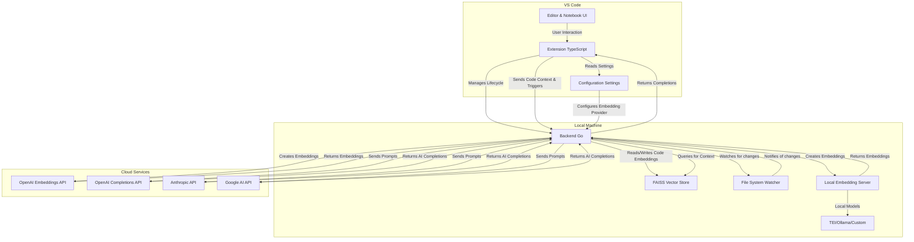

# Autocomplete Extension Architecture

This document outlines the architecture for the AI-powered autocomplete extension with configurable embedding providers.

## System Design

The system consists of two main components: a VS Code extension (the "client") and a local Go server (the "backend"). The backend supports multiple embedding providers for code similarity search, including OpenAI embeddings and local embedding servers. They communicate over a local API.



## Embedding Provider Architecture

The system now supports multiple embedding providers to improve performance and privacy:

### OpenAI Embeddings (Default)
- Uses OpenAI's text-embedding-3-small or text-embedding-3-large
- Requires internet connection and API key
- 1536 or 3072 dimensions respectively
- Higher latency due to network calls

### Local Embeddings
- Eliminates network latency for embedding generation
- Supports multiple local server types:
  - **TEI (Text Embeddings Inference)**: HuggingFace's production embedding server
  - **Ollama**: Easy-to-use local model server
  - **Custom**: OpenAI-compatible API format
- Auto-detects embedding dimensions
- Configurable through VS Code settings or environment variables
- Privacy-focused: code never leaves your machine

### Configuration Options

#### VS Code Settings
```json
{
  "autocomplete.embeddingProvider": "local", // or "openai"
  "autocomplete.openai.model": "text-embedding-3-small",
  "autocomplete.local.serverUrl": "http://localhost:8080",
  "autocomplete.local.serverType": "tei",
  "autocomplete.local.modelName": "BAAI/bge-small-en-v1.5",
  "autocomplete.local.timeout": 30
}
```

#### Environment Variables
```bash
export EMBEDDING_PROVIDER=local
export LOCAL_EMBEDDING_URL=http://localhost:8080
export LOCAL_EMBEDDING_SERVER_TYPE=tei
export OPENAI_EMBEDDING_MODEL=text-embedding-3-small
```

## Plan of Action

The project is broken down into three phases:

### Phase 1: Backend Core (Go) ✅ COMPLETED
- **1.1:** ✅ Set up Go project structure and dependencies.
- **1.2:** ✅ Implement a local HTTP/gRPC server.
- **1.3:** ✅ Implement a file system watcher to monitor the workspace.
- **1.4:** ✅ Integrate FAISS for local vector storage.
- **1.5:** ✅ Implement code chunking and embedding logic.
- **1.6:** ✅ Create API clients for OpenAI, Anthropic, and Google.
- **1.7:** ✅ Implement the core completion logic (context retrieval, prompt engineering, API call).
- **1.8:** ✅ Define API endpoints for indexing and code completion.
- **1.9:** ✅ **NEW**: Implement configurable embedding providers (OpenAI/Local).
- **1.10:** ✅ **NEW**: Add support for multiple local embedding server types (TEI, Ollama, Custom).
- **1.11:** ✅ **NEW**: Auto-detect embedding dimensions for dynamic vector store creation.

### Phase 2: VS Code Extension (TypeScript) ✅ COMPLETED
- **2.1:** ✅ Set up a new VS Code extension project.
- **2.2:** ✅ Implement logic to manage (start/stop) the Go backend process.
- **2.3:** ✅ Create a settings UI for users to input their API keys.
- **2.4:** ✅ Implement an API client to communicate with the local Go backend.
- **2.5:** ✅ Register a completion provider for standard code files.
- **2.6:** ⏳ Register a completion provider for VS Code Jupyter Notebook cells.
- **2.7:** ✅ Implement logic to display streaming completions in the editor.
- **2.8:** ✅ **NEW**: Add configuration settings for embedding providers.
- **2.9:** ✅ **NEW**: Pass embedding configuration as environment variables to backend.
- **2.10:** ✅ **NEW**: Implement automatic ghost text completions with Tab acceptance.

### Phase 3: Integration & Packaging
- **3.1:** ⏳ Write comprehensive tests for both backend and frontend.
- **3.2:** ✅ Create a build script to compile the Go binary and package the VS Code extension.
- **3.3:** ✅ Document the setup and usage process.
- **3.4:** ✅ **NEW**: Create comprehensive local embeddings setup guide.
- **3.5:** ✅ **NEW**: Document embedding provider configuration options.
- **3.6:** ⏳ **NEW**: Add performance benchmarks for different embedding providers.
